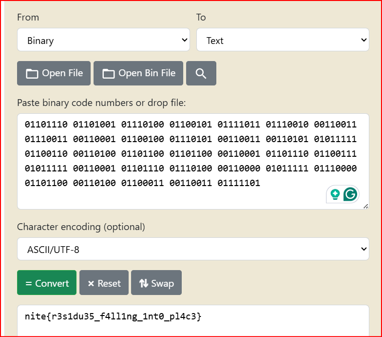

Custom challenges - Cryptography


# 1. all signs alien
- decode the given python script and data give to obtain the flag

## Solution:
- the question provided a encrypting code where a random integer was generated and set of mathematical operations are done to check for a specific condiotn (more in the videos below) and another function where the negative is generated.
- a fixed value a is taken and the code outputs one value for each of the bits where one is positive to encode on type of bit and the other is negative to encode the other type of bit.
- 1 is generated if the condiotn is satisfied or -1 but we dont know if it stands for the output as 0 or as 1 so we must try decoding both ways
- for eahc output value v in our script we compute the date and if we get value 1 then it is a quadratic residue and if we get output p-1 then it is a quadratic no residue
- so first option we assume it is a residue and code 0 if i is 1 and code 1 if i is p-1
- second option is we assume it is a non residue and code 1 if i is 1 and code 0 if i is p-1
- we collect the bits in the order and find out that we got 263 bits so we add a zero infornt so it doesnt change the number and then we now convert this 264 bits to text and obtain the flag
- 

```
import sys

p = 9129026491768303016811207218323770273047638648509577266210613478726929333106121387323539916009107476349319902011390210650434835260358014251332047605739279

def compute_list(values):
    return [pow(v,(p-1)//2,p) for v in values]

def binary_from_output(computeted_input):
    # consider and print both the posibilities
    binary_A=[]
    binary_B=[]
    for i in computeted_input:
        if i == 1:
            binary_A.append('0')
            binary_B.append('1')
        elif i == p-1:
            binary_A.append('1')
            binary_B.append('0')
    return ''.join(binary_A), ''.join(binary_B)

#MAIN 
path = 'out.txt'
with open(path, 'r') as f:
    s = f.read().strip()
input = eval(s) 

output_computation = compute_list(input)

binary_A=binary_from_output(output_computation)
binary_B=binary_from_output(output_computation)

print("Binary: ")
print(binary_A)
print(binary_B)
```
-
## Flag:
```
nite{r3s1du35_f4ll1ng_1nt0_pl4c3}
```
## Concepts learnt:
- i learnt a lot about using the python in general for ctfs as wel as coding
- i learnt in depth about qudratic residue, eulers criteria, representation symbols, primtive roots more of which can be understood in the videos below
- refer to the attached playlist as well
## Resources:
-[quadratic residue](https://www.youtube.com/watch?v=M6gDsFhQugM)
-[eulers criterion](https://www.youtube.com/watch?v=2IBPOI43jek)

***


# 2. Residue refinery
- understand the given challenge and obtain the flag
## Solution:
- the program first retrives the flag from secret.py and checks if lenght is even and extracts bytes inside a prefix.
- now a class is created iniializing a num object which takes input number which are coefficients of a polynomial then number 257 is assigned and since it is a prime it is generally the mod operation and then polynomial coefficients are initialized.
- add function is defined which does the coefficeint wise addition and then mod 257
- mul function defined where the array is initialzed to 5 zeroes and then multiplication is done for the two polynomials. After the loops prod holds coeffcients of the multiplied polynomial. now the next step returns polynomial reduction of modulo output
- in polynomical reduction field is defined as (x^2-3=0) so for any x^2 term or higher we replace the term with 3 to bring it back to degree 1 and then we individually apply modulo with the p value and get the final polynomial
- another to_bytes function is initialised to convert Num object to sequence of bytes for storage/transmission and then reverses the bytes so from (b0,b1)->(b1,b0) and this ends here

- now a random 2 byte key is initiated (k0,k1) and an empty byte array size of flag is created. Then the print function prints the first two bytes of plaintext flag in hexadecimal.
- then the loop iterates through 2 bytes at a time encrypting each 2 byte block independently.
- the encryption creates a num object repressenting the key where bytes are treated as coefficients and another num object is created which represent the plain text where each two bytes represent coeffiects of polynomial. So next polynomial multiplication is done followed by modulo reduction using (X^-3) and p=257
- Cipher polynomial = (Key Polynomial.Plaintext Polynomial) mod{x^2 - 3, 257}
- the resulting output is converted back to bytes reversing the byte order and entire cipher is printed in hex
```
MATRIX TYPE:
[c1]   [ k1   k0 ] [f0]
[c0] = [ k0  3*k1] [f1] 
```
- the flag initial and output is given

```
- flag[:2].hex() = '316d'

f0=0x31=49, f1=0x6d=109
c1 = 0x98 (152), c0 = 0x13 (19)
so

109*k0 + 49*k1 ≡ 152  --> eq 1
49*k0 + 70*k1  ≡ 19   --> eq 2  (3*109 ≡ 70 (mod 257))

k0=60, k1=6 (solving this can be done using online calc or matrix or python script)

then we initialze the matrix
A =  [6, 60],
     [60, 18]   (since 3*k1 = 18)
det = 3*k1^2 - k0^2 = 106 (mod 257) and the modular inverse det^-1 = 177 (mod 257)

A^-1 = 177 * [[18, -60],
              [-60, 6]]  (mod 257)

       = [[102, 174],
          [174, 34]]  (mod 257)

so
f0 = (102*c1 + 174*c0) mod 257
f1 = (174*c1 + 34*c0)  mod 257

mod = 257
Ainv = [[102, 174],
        [174, 34]]

hexct = "9813d3838178abd17836f3e2e752a99d5cd3fba291205f90c1d0a78b6eca"
ct = bytes.fromhex(hexct)

out = bytearray()
for i in range(0, len(ct), 2):
    c1 = ct[i]
    c0 = ct[i+1]
    f0 = (Ainv[0][0]*c1 + Ainv[0][1]*c0) % mod
    f1 = (Ainv[1][0]*c1 + Ainv[1][1]*c0) % mod
    out.append(f0)
    out.append(f1)

print(out)            
```
## Flag:
```
nite{import_module!_i_am_the_module}
```
## Concepts learnt:
- i learnt about objects and fucntions using the numpy libarary and how those functions are used and initialized.
- a more in depth understanding of modulo operator in cryptography and tweaking the python script to get the desired output
- the euclidean algorthim and application of computational mathematics
## Resources:
- [about numpy](https://www.w3schools.com/python/numpy/default.asp)
- [equation solver](https://www.dcode.fr/modular-arithmetic)
***


# 3. Quixorte
- find the decyrption in the python file and obtain the flag
## Solution:
- so understanding the script first the rotate function performs right bit shift and left bit shift and or operator is run between them followed by and operator with another number bit by bit. Then there is a xor function where xor is applied after rotation and every time it is appended it is xored with the already xored array and then appended with a key which is genretaed randomly but of 8 bytes as mentioned.
- so first to obtain the key we know the magic btes or the first few bytes of a png file which are the standard header files so we obtain those standard bytes and then first apply the rotate function. Now we apply the multiple xor function by intialising a xor prefix array to 0 and then we apply xor function twice along with the xor prefix every time to obtain the key and eventually we get the key
- now with this key as reference we take the encoded data and de rotate and followed by the and operator. Now with the key we dexor the the encoded data and finally save this data and export the decoded png file .When i opened the png file i got the flag.
```
def rotate(b, i):
    i %= 8
    return ((b >> i) | ((b << (8 - i)) & 0xFF)) & 0xFF
def derotate(b, i):
    i %= 8
    return (((b << i) & 0xFF) | (b >> (8 - i))) & 0xFF

def decrypt(encoded, final):
    with open(encoded, "rb") as f:
        enc = bytearray(f.read())

    n = len(encoded)
    key = 8 
    magic_bytes = bytearray([0x89, 0x50, 0x4E, 0x47, 0x0D, 0x0A, 0x1A, 0x0A])

    rot_magic = [rotate(b, i) for i, b in enumerate(magic_bytes)]
    key = [0] * key

    xor_out = 0
    for k in range(key):
        key[k] = rot_magic[k] ^ encoded[k] ^ xor_out
        xor_out ^= key[k]

    key_bytes = bytes(key)
    print("key:", key_bytes.hex())

    decoded = bytearray(encoded)
    for i in reversed(range(n-key+1)):
        for j in range(key):
            decoded[i + j] ^= key_bytes[j]

    flag = bytearray(derotate(b, i) for i, b in enumerate(decoded))

    with open(final, "wb") as f:
        f.write(flag)
    print("decrypted", final)


decrypt("quote.png.enc", "quote_decrypted.png")

```
## Flag:
```
nite{t0_b3_XOR_n0t_t0_b3333}
```
## Concepts learnt:
- i learnt a lot about xoring and its properties and in the dexor function we start backward since we have to undo all the xors and hence obtain the dexor function. This attention was very important in writing the dexor function

## Resources:
-[magic bytes](https://gist.github.com/leommoore/f9e57ba2aa4bf197ebc5)
-[properties of xor](https://medium.com/@Harshit_Raj_14/useful-properties-of-xor-in-coding-bitwise-manipulation-and-bitmasking-2c332256bd61)
***


# 4. Willys chocolate experience
- understand the python script and obtain the flag
## Solution:
- The challenge converts the flag into a large integer using bytes_to_long and his integer is called the ticket.
- Goal is to recover it from two consecutive values of a function f(m) = 13^m + 37^m (mod p)
- We simplify the expression and solve the discrete log problem using Baby Step Giant Step (BSGS) and Pohlig-Hellman algorithms and then all the results are then combined using the Chinese Remainder Theorem, which gives us m-1 and converting this to bytes gives us the flag

```
from collections import Counter
from Crypto.Util.number import inverse, long_to_bytes

p = 396430433566694153228963024068183195900644000015629930982017434859080008533624204265038366113052353086248115602503012179807206251960510130759852727353283868788493357310003786807
a = 208271276785711416565270003674719254652567820785459096303084135643866107254120926647956533028404502637100461134874329585833364948354858925270600245218260166855547105655294503224
b = 124499652441066069321544812234595327614165778598236394255418354986873240978090206863399216810942232360879573073405796848165530765886142184827326462551698684564407582751560255175
c = 37


DLP_TARGET_BETA = ((a - 13 * b) * inverse(24, p)) % p

def find_prime_factors(n, max_bound=2000000):
    factors = Counter()
    d = 2
    temp_n = n
    
    while d * d <= temp_n and d <= max_bound:
        while temp_n % d == 0:
            factors[d] += 1
            temp_n //= d
        d = 3 if d == 2 else d + 2
        
    return factors, temp_n

def baby_step_giant_step(base, target, modulus, exponent_limit):
    m = int(pow(exponent_limit, 0.5)) + 1
    
    baby_table = {}
    current_val = 1
    for j in range(m):
        if current_val not in baby_table:
            baby_table[current_val] = j
        current_val = (current_val * base) % modulus

    step_size = pow(inverse(base, modulus), m, modulus)
    
    current_gamma = target
    for i in range(m + 1):
        if current_gamma in baby_table:
            # Match found: x = i*m + j
            j = baby_table[current_gamma]
            return (i * m + j) % exponent_limit
        current_gamma = (current_gamma * step_size) % modulus
        
    return None

def pohlig_hellman(base, target, modulus):
    
    N = modulus - 1
    
    prime_factors, remainder = find_prime_factors(N)
    if remainder != 1:
        prime_factors[int(remainder)] += 1

    parts = []
    
    for q, e in prime_factors.items():
        pe = q ** e 
        
        subgroup_base = pow(base, N // pe, modulus)
        subgroup_target = pow(target, N // pe, modulus)
        
        t = baby_step_giant_step(subgroup_base, subgroup_target, modulus, pe)
        parts.append((t, pe)) 

    overall_solution = 0
    total_modulus = 1
    for _, mod_i in parts:
        total_modulus *= mod_i
    
    for congruence, mod_i in parts:
        Mi = total_modulus // mod_i
        overall_solution = (overall_solution + congruence * Mi * inverse(Mi, mod_i)) % total_modulus
        
    return overall_solution
T_minus_1 = pohlig_hellman(c, DLP_TARGET_BETA, p)
TICKET_INT = T_minus_1 + 1
print(long_to_bytes(TICKET_INT).decode())
```
## Flag:
```
nite{g0ld3n_t1ck3t_t0_gl4sg0w}
```
## Concepts learnt:
- this was a very hard crypto challenge and took me a lot of effort
- i learn about baby step small step, chinese remainder theorem etc and took a lot of new math concepts to understand

## Resources:
-[Baby step giant step](https://en.wikipedia.org/wiki/Baby-step_giant-step)
-[chinese remainder theorem](https://www.geeksforgeeks.org/dsa/introduction-to-chinese-remainder-theorem/)
***


# 5. SpAES Oddity
- launch the server understand the encryption and obtain the flag
## Solution:
- the server takes the input with odd number of letters and adds the hidden flag after the message and pads with multiple of 16 letters of junk and encrypts with AES-ECB
- AES-ECB is like photocopier where if two 16 letter junks are the same they become the same encrypted blob
- so to break it first we sent exactly 15 letters so total 15+49=64 and 4 encrypted blocks
- we put in the first encryption block which looked like the 15 A's and tried 256 combinations to get first real letter as n
- repeating this 49 times each time replacing one more A with the letters guessing first 4 being n, i, t, e.. etc
- Whenever the 16-letter we keyed in was identical to the real one including the hidden flag letters, the encryption gave us the exact same ciphertext as before.
```
- first 16-letter block was: AAAAAAAAAAAAAA + first letter of the flag (in hex 414141414141414141414141414141??) --> so first letter was n
```
## Flag:
```
nite{D4v1d_B0w13_1n_th3_5ky_w1th_d14m0nd5}
```
## Concepts learnt:
- i learnt about AES-ECB oracle encryption
- learning bout pwn tools for exploiting such servers
- knowing that always python scripts dont work and manual try is very important to also get the flag as server might not give the response in accordance to the script
## Resources:
- [about ECB oracle](https://medium.com/@siyam.exe/day-3-ecb-oracle-cryptohack-92f4966cef4d)
- [understanding/breaking AES-ECB](https://www.uptimeconsulting.no/breaking-aes-ecb-with-an-encryption-oracle-attack/)
***
