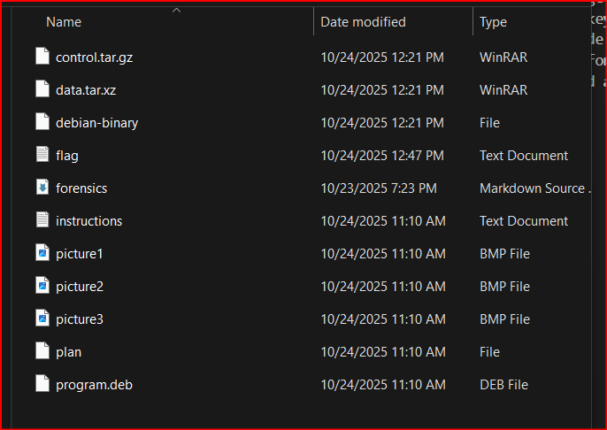
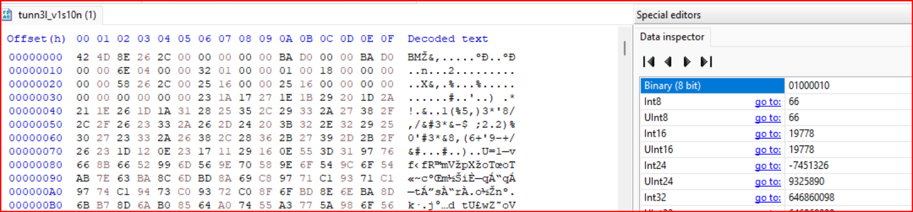
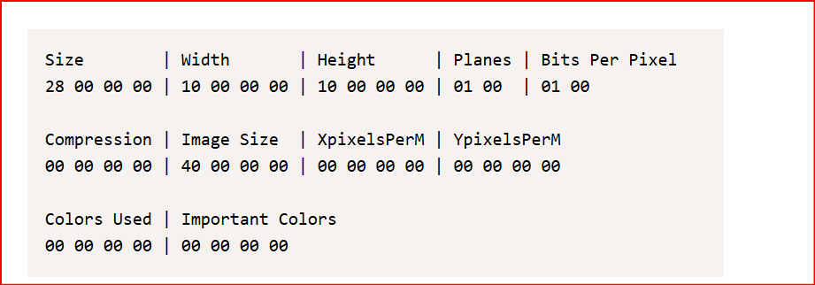
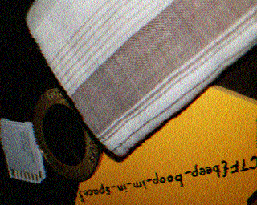

# 1. Trivial flag transfer protocol
i have to go through the attached .pcapng and obtain the flag

## Solution:
- so the file was in pcapng format and after going threw few resouces wireshark is a software which helps us put out clearly the packets mentioned with protocols as well as objects can be exported
- since the name of the file was tftp and there were lot of transfers using this protocol trivial file transfer protocol uses user datagram protocol or udp on port 69 and supports two basic functions of reading and writing files. This tftp lacks authentication.
- Then i went to file to extract the farious files/objects and a bunch of files were put out includeing instructions, plan and a debian package as well as three pictures
-
- The instructions file conisted some text and on further examniation it was a standard rot13 cipher so on decoding it it provided a message to look in the plan file
- On decoding the plan file using the same rot13 cipher it mentioned that the program.deb pakchage shall be used and figured out that the key is DUEDILIGENCE
- now i opened the debian package and found various files there and once i go into one of them i saw steghide and then i serached up stegide and it opened a page and understood that it is a method of hiding data in audio/video so then on terminal i used man command to unnderstand the arguments required for steghide
- so then i used this steghide command for individual pictures using DUEDILIGENCE as the password and evntually the third picture extracted a file called flag.txt and on catting that file we obtain the flag.

```
dhiraj@DESKTOP-361HESD:/mnt/c/Users/user/downloads$ file tftp.pcapng
tftp.pcapng: pcapng capture file - version 1.0

dhiraj@DESKTOP-361HESD:/mnt/c/Users/user/desktop/Cryptonite/task_phase_2/Picoctf/forensics$ file program.deb
program.deb: Debian binary package (format 2.0), with control.tar.gz, data compression xz

dhiraj@DESKTOP-361HESD:/mnt/c/Users/user/desktop/Cryptonite/task_phase_2/Picoctf/forensics$ steghide extract -sf picture1.bmp
Enter passphrase:
steghide: could not extract any data with that passphrase!
dhiraj@DESKTOP-361HESD:/mnt/c/Users/user/desktop/Cryptonite/task_phase_2/Picoctf/forensics$ steghide extract -sf picture2.bmp
Enter passphrase:
steghide: could not extract any data with that passphrase!
dhiraj@DESKTOP-361HESD:/mnt/c/Users/user/desktop/Cryptonite/task_phase_2/Picoctf/forensics$ steghide extract -sf picture3.bmp
Enter passphrase:
wrote extracted data to "flag.txt".
dhiraj@DESKTOP-361HESD:/mnt/c/Users/user/desktop/Cryptonite/task_phase_2/Picoctf/forensics$ cat flag.txt
 ```

## Flag:
```
picoCTF{h1dd3n_1n_pLa1n_51GHT_18375919}
```
## Concepts learnt:
- pcapng is pcap next generation file format which stores network packet data ad well as individual packer records and pcap genreally stands for packet capture.
- it stores every packet of data passed through the internet during a period and used for network check, monitoring and security over the internet. each record holds data including time and lenght of captured data.
- wireshark is a graphical tool which can help or tshark is command which can be used on terminal or tcpdump is another command often used in linux systems
- since the name of the file was tftp and there were lot of transfers using this protocol trivial file transfer protocol uses user datagram protocol or udp on port 69 and supports two basic functions of reading and writing files. This tftp lacks authentication.
- a debian package is basically a installer type in windows and consists of packages to run a software.
- Steghide is a steganography program that is able to hide data in various kinds of image- and audio-files. The color- respectivly sample-frequencies are not changed thus making the embedding resistant against first-order statistical tests.
- syntax: steghide command [arguments], we used --extract to obtain data and --sf is the stegofile followed by the name of the file

## Resources:
- [regardinng tftp](https://www.geeksforgeeks.org/computer-networks/what-is-tftp-trivial-file-transfer-protocol/)
- [steghide](https://steghide.sourceforge.net/)
***


# 2. Tunnel vision
i have to go through the attached file and obtain the flag

## Solution:
- so at first i used the file command to see what file it was and the system just printed data so next what i did was i put the file in the hex editor and in the hexdump the first two characters wwre bm which gave us a small information that the file was a bitmap image so i went ahead and renamed it to .bmp but the file didnt open giving us a clue that it was corrupted. 
-
- i surfed the internet and found two sites about magic numbers which signify the first few bytes and gives us the file information and a detailed bitmap file format so putting that aside i downloaded another bitmap image and compared the bytes on the first line and changed them accordingly as changing the file header can be one of the main solutions to a corrupted image and once i did so and saved the image, a image with weird dimensions opened with a message printed not a flag sorry which meant that there was more to it
- since the file size was smaller and weird maybe the full size wasnt being shown because the size was corrupted as well so i moved to terminal and used the exiftool to see the height and width of the image and compared them and found out that the second line of the hex code mentions the dimensions of the image.
- 
- after going throught the bitmap file format article and putting a hex to decimal converter i changed the height of the images by trial and error and after few tries i got the complete image with the flag on the top.

```
dhiraj@DESKTOP-361HESD:/mnt/c/Users/user/downloads$ file tunn3l_v1s10n
tunn3l_v1s10n: data
dhiraj@DESKTOP-361HESD:/mnt/c/Users/user/downloads$ exiftool tunnel_vision.bmp
ExifTool Version Number         : 12.40
File Name                       : tunnel_vision.bmp
Image Width                     : 1134
Image Height                    : 306
Image Size                      : 1134x306
 ```

## Flag:
```
picoCTF{qu1t3_a_v13w_2020}
```
## Concepts learnt:
- the header is the most important part of the file and controls the functioning and main file format and small chnaged to that can corrupt the file as a whole and prevent opening of the image.
- magic numbers are the first few bytes of a file and the same file format have the same magicnumbers and having a tab on that can help crack file formats very quickly.
- learnt a lot about bmp file format where the header consists of bytes including offset and the next line consists of bytes representin gthe size, height and width of image and controling those aspects changs the number of pixels respectively
## Resources:
- [CyberChef- A web-based decoding, encoding, encryption, and data analysis tool](https://cyberchef.org/)
- [file magic numbers(identify file type)](https://gist.github.com/leommoore/f9e57ba2aa4bf197ebc5)
- [about bmp file format](https://www.donwalizerjr.com/understanding-bmp/)

***


# 3. Moon walk
- decode the audio file

## Solution:
- i downloaded the audio file and it was a wav format with some strange noises and the hints mentioned a question of how pictures from moon landing get back to space and on searching one of the first ways was sstv or slow scan television and then i searched up for sstv decoder and uploaded the .wav file to obtain the image in which the flag was printed 
- 

## Flag:
```
picoCTF{beep_boop_im_in_space}
```
## Concepts learnt:
- pictures from the moon landing were sent to the earth by slow-scan television camera which transmits low-bandwidth images using radio waves.
- They are transmitted over audio signals and different frequencies represent different elements like birghtness, color etc and is a classical method of hiding or encoding visual message within an audio file.

## Resources:
-[online sstv decoder](https://sstv-decoder.mathieurenaud.fr/)

***
