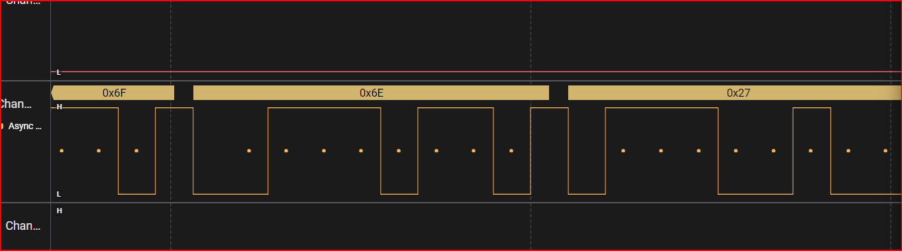

# 1. iq test
- input the number and solve the logic gates

## Solution:
- so at first since there are 36 inputs and it was logic gates the inputs had to be 0's and 1's so i converted the input number to binary with was 34bits and added a 0 infront which was the 35th and assigned them to each input
- the circuit was 12 similar circuits taking three inputs and giving one output so overall there were 8 different combinations in the given binary form so i solved the ciruits 8 times and hence notes down each input and obtained the flag

## Flag:
```
nite{100100110110}
```
## Concepts learnt:
- i knew logic gates before in hand but it took me quite sometime to crack this as it needed a good amont of thinking and a wide understanding of nor and xnor gates
***


# 2. I like logic
- open the zip file and obtain the flag

## Solution:
- so after seraching up about .sal i figured out it is salae and had to download a logic analyser device so i went ahead and donwloaded the software and uploaded the .sal file to the software where it opened all the files and for the third file it showed signals
- 
- the first step was setting up an analyser and i selected the wrong one which was I2C as it was the common default choice and d3 had pulsating lines ans since ther was only one line pulsating like we learnt in FE it probably might have been asychronous and the bps rate was about 2 per millisecond and once it was applied the data value was printed aboe each pulse and a table was extracted which ocnsisted of the output of each pulse so i opened that and exported the file whic created a .csv file. I opened it and it had a bunch of characters represeted in hexadecimal
## Flag:
```
FCSC{b1dee4eeadf6c4e60aeb142b0b486344e64b12b40d1046de95c89ba5e23a9925}
```
## Concepts learnt:
- .sal file is the digital type of a recording of electrical signals from a circuit and stores data recorded by a saleae device. the recorder volatge changes over up and down states.
- it is basically a .zip file and we find .jsonand multiple .bin files which are binary data that hold signals and the data.

## Resources:
- [about saleae and its analysers](https://file.org/extension/sal)
- [saleae analysers](https://support.saleae.com/user-guide/protocol-analyzers/analyzer-user-guides/using-async-serial)
***


***


