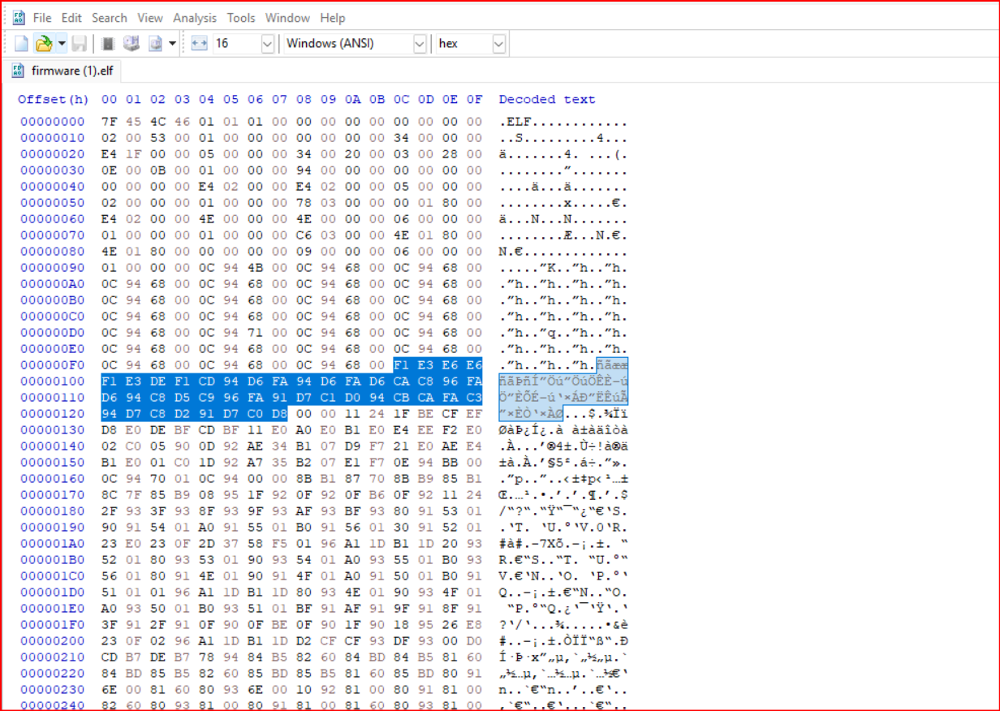

# 1. iq test
- input the number and solve the logic gates

## Solution:
- so at first since there are 36 inputs and it was logic gates the inputs had to be 0's and 1's so i converted the input number to binary with was 34bits and added a 0 infront which was the 35th and assigned them to each input
- the circuit was 12 similar circuits taking three inputs and giving one output so overall there were 8 different combinations in the given binary form so i solved the ciruits 8 times and hence notes down each input and obtained the flag

## Flag:
```
nite{100010011000}
```
## Concepts learnt:
- i knew logic gates before in hand but it took me quite sometime to crack this as it needed a good amont of thinking and a wide understanding of nor and xnor gates
***


# 2. I like logic
- open the zip file and obtain the flag

## Solution:
- so after seraching up about .sal i figured out it is salae and had to download a logic analyser device so i went ahead and donwloaded the software and uploaded the .sal file to the software where it opened all the files and for the third file it showed signals
- 
- the first step was setting up an analyser and i selected the wrong one which was I2C as it was the common default choice and d3 had pulsating lines ans since ther was only one line pulsating like we learnt in FE it probably might have been asychronous and the bps rate was about 2 per millisecond and once it was applied the data value was printed aboe each pulse and a table was extracted which ocnsisted of the output of each pulse so i opened that and exported the file whic created a .csv file. I opened it and it had a bunch of characters represeted in hexadecimal
## Flag:
```
FCSC{b1dee4eeadf6c4e60aeb142b0b486344e64b12b40d1046de95c89ba5e23a9925}
```
## Concepts learnt:
- .sal file is the digital type of a recording of electrical signals from a circuit and stores data recorded by a saleae device. the recorder volatge changes over up and down states.
- it is basically a .zip file and we find .jsonand multiple .bin files which are binary data that hold signals and the data.

## Resources:
- [about saleae and its analysers](https://file.org/extension/sal)
- [saleae analysers](https://support.saleae.com/user-guide/protocol-analyzers/analyzer-user-guides/using-async-serial)
***


# 3. Bare metal alchemist
- crack open the firmware.elf 

## Solution:
- so we got a .elf file and a clue which said bare metal alchemist but i serached up the anime and it was full metal alchemist and these clues were to be used to obtain the flag 
- i put the flag in ida but it said pro verison is required so i downloaded the ghidra file viewer and then it opened the code and it was something similar to reverse engineering where there were differnet variable of the form of registers.
- The relation between the clue and this challenge is relating to the addresses. alchemy is basically transformation of one thing and reconstructing it into another like here i used a formula  which was XOR with 0xA5 to transform the bytes back into their original. The code used high resister and address usage and took me quite some time to understand.
- so basically one register was given a number 0xa5 which is 165 and loop was given an address and an operation was performed on every byte and loops stops when the encrypted byte equals to the key and then a null character was present so the plain text was xored with key and exits on 0 byte
so we xored the encrypted byte with key to decrypt all bytes one by one and then we obtain the flag
- then we go to the window and open .data and observed the offset and found the data located. Through an online xore webssite i xored each number and objtained the flag
- 

```
R11 = 0xa5     --> set key 0x45
Z._0_1_ = (byte)R25R24 ^ R11     --> read byte
if (((byte)R25R24 & 4) == 0)    --> stops on 0
```
## Flag:
```
TFCCTF{Th1s_1s_s0m3_s1mpl3_4rduno_f1rmw4re}
```
## Concepts learnt:
- i learnt how c codes instead of writing purely in variables is written some form in registers and adresses which is pretty complex when seen directly and each small code should be analysed with caution
- so to understand how manula xoring takes place we convert each number to the binary form and every bit by bit we perform xor operation and write down the final value convert that to hexadecimal or the decimal value which is nothing but the ascii value
- ghidra is great software to use and obtain information about new file types
## Resources:
- [reading elf file](https://www.geeksforgeeks.org/linux-unix/readelf-command-in-linux-with-examples/)
- [hex xor calculator](https://xor.pw/)
***


