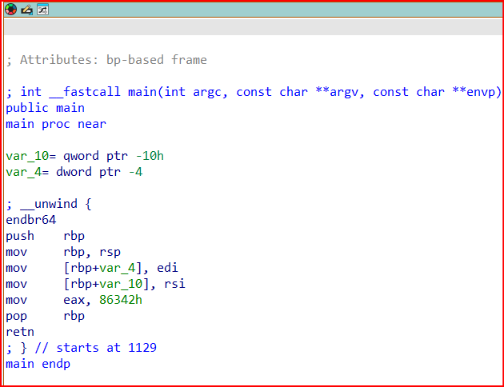

# 1. GDB baby step 1
Can you figure out what is in the eax register at the end of the main function? Put your answer in the picoCTF flag format: picoCTF{n} where n is the contents of the eax register in the decimal number base. If the answer was 0x11 your flag would be picoCTF{17}.

## Solution:
- so i watched the videos provided and realised the file is of some specfic format and then to look up at the file format i used the file command and then the terminal printed the format
- after going threw the videos i realised that to read the file or the assembly language code we have to dissassemble and objdump command as well as ida are some softwares which help us do so. I went threw the content printed when i used objdump command and since the description mentioned main i looked for the main title and there i saw the eax string beside which a hexadecimal number was present. Just to try out i cconverted that number to decimal and that turned out to be the flag. This was an approach
- The second approach was i downloaded the ida software on my computer and then disassmbled this file and then it showed mov string beside which eax was written and a number was provided along which h which i assumed meant it said hexadecimal so then i converted that to decimal and then obtained the flag
 
- 

```
dhiraj@DESKTOP-361HESD:/mnt/c/Users/user/downloads$ file debugger0_a
debugger0_a: ELF 64-bit LSB pie executable, x86-64, version 1 (SYSV), dynamically linked, interpreter /lib64/ld-linux-x86-64.so.2, BuildID[sha1]=15a10290db2cd2ec0c123cf80b88ed7d7f5cf9ff, for GNU/Linux 3.2.0, not stripped

dhiraj@DESKTOP-361HESD:/mnt/c/Users/user/downloads$ objdump -d debugger0_a
0000000000001129 <main>:
    1129:       f3 0f 1e fa             endbr64
    112d:       55                      push   %rbp
    112e:       48 89 e5                mov    %rsp,%rbp
    1131:       89 7d fc                mov    %edi,-0x4(%rbp)
    1134:       48 89 75 f0             mov    %rsi,-0x10(%rbp)
    1138:       b8 42 63 08 00          mov    $0x86342,%eax
    113d:       5d                      pop    %rbp
    113e:       c3                      ret
    113f:       90                      nop
```

## Flag:
```
picoCTF{549698}
```
## Concepts learnt:
- The EAX register is a device that plays a crucial role in arithmetic, system calls, and function handling.
- in c and c++ whe functions return a value of datatype integer, string or pointer the value is loaded in EAX register before the function closes.
- in the ida dissassembler the command (mov destination,source) so it is something which signified that the hexadecimal number is going to the eax registar destination and that was the same as shown in objdump output

## Notes:
- whenever you find such files reading and understanding them is the key so always refer to these videos so that they help you understand how to read and understand those files
## Resources:
- [reading the binary source code](https://youtube.com/watch?v=1d-6Hv1c39c)
- [reading the ida output](https://youtube.com/watch?v=gh2RXE9BIN8)

***


# 2. ARMssembly1
For what argument does this program print `win` with variables 81, 0 and 3? File: chall_1.S 

## Solution:
- so basically i have to go threw the source code file and understand what the function provided is doing and accordingly obtain the number.
- i started reading from main and from the video understood that numbers are ebing input into registers and then a function is called. further in the mainn function it compared 0 and another output and next command bne says that if output is not equal to zero print you lose so we understood that for you win output shall be 0.
- so now i scrolled up to the function to read the function binary source code where i saw that there are three numbers 81, 3, 0 being set into variables.
- the first command was lsl which loosley meant shift left or bitwise shift operator for 81 to shift by 0 and return numbers so when u shift 81 0 times it remains 81
- the next command was division and the varibales being 81 and 3 so when divided give 27 and is returned.
- next the initial variable was loaded which is the argument we provide for the function so it takes thi argument and performs subtraction with 27 and retunr the final answer.
- so now the main checks if the answer returned by the function is 0 and then types out you win if it is 0 so the number we should provide here is 27 for the final answer to be returned as 0.

```
main:
	stp	x29, x30, [sp, -48]!
	add	x29, sp, 0
	str	w0, [x29, 28]
	str	x1, [x29, 16]
	ldr	x0, [x29, 16]
	add	x0, x0, 8
	ldr	x0, [x0]
	bl	atoi
	str	w0, [x29, 44]
	ldr	w0, [x29, 44]
	bl	func
	cmp	w0, 0
	bne	.L4
	adrp	x0, .LC0
	add	x0, x0, :lo12:.LC0
	bl	puts
	b	.L6
    
func:
	sub	sp, sp, #32
	str	w0, [sp, 12] 
	mov	w0, 81 
	str	w0, [sp, 16]
	str	wzr, [sp, 20]
	mov	w0, 3
	str	w0, [sp, 24]
	ldr	w0, [sp, 20]
	ldr	w1, [sp, 16]
	lsl	w0, w1, w0
	str	w0, [sp, 28]
	ldr	w1, [sp, 28]
	ldr	w0, [sp, 24]
	sdiv	w0, w1, w0
	str	w0, [sp, 28]
	ldr	w1, [sp, 28]
	ldr	w0, [sp, 12]
	sub	w0, w1, w0
	str	w0, [sp, 28]
	ldr	w0, [sp, 28]
```
## Flag:
```
picoCTF{0000001b}
```
## Concepts learnt:
- .arch armv8-a tells us that is a 64bit assembly challenge
- lsl stands for leftwise shift which is a bitwise operator we learnt in c
- i leanr many ways of reading the binary souce code files so always go through the videos and make sure you understand the memory addresses clearly there and there is 4 bytes gap as an integer is assgined 4 bytes in c
## Notes

## Resources:
- [reading the binary source code](https://youtube.com/watch?v=1d-6Hv1c39c)
- [reading the ida output](https://youtube.com/watch?v=gh2RXE9BIN8)

***


# 3. vault door 3
This vault uses for-loops and byte arrays. The source code for this vault is here: VaultDoor3.java

## Solution:
- this compared to others was a relatively simple challenge so we go through the java file and see that it is a simple password entering porgram which checks if it is a right password and to make is stronger the password checker creteas a new buffer string array which is created temporarily and this buffer array takes the entered password in the input and performs inputs where they rpogram is represented in 4 loops where first 8 letters are as it is and the other 3 loops alter the strings accordingly and compare it with the final string provided.
- so according to the loops we decode the flag from the comapare string provided and obtain the flag

## Flag:
```
picoCTF{jU5t_a_s1mpl3_an4gr4m_4_u_79958f}
```
## Concepts learnt:
- reverse engineering is one domain where we should think in the other way around like in this question where we derived the password from a sting that has been through multiple loops so we think backword and crack the flag accordingly

## Notes:

## Resources:

***
