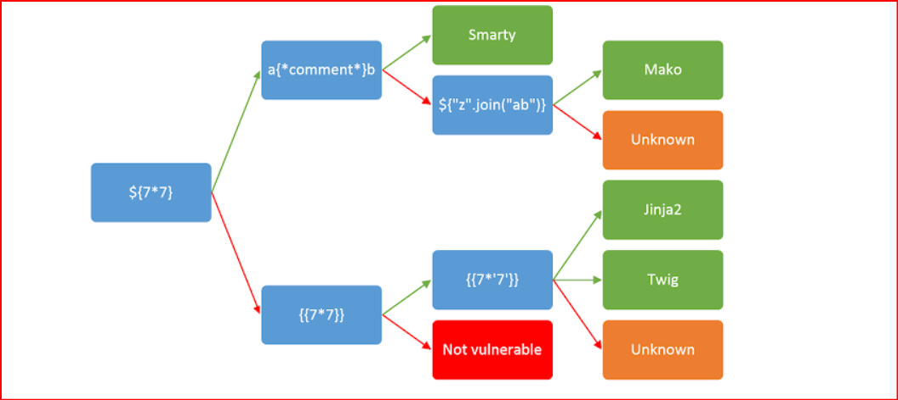
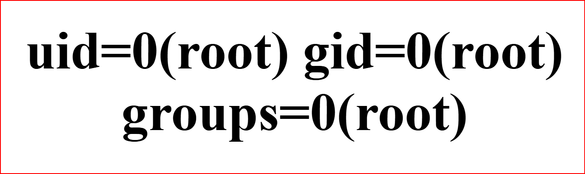

# 1. Web gauntlet
- use the specific sql injections and bypass the filters

## Solution:
- so the first filter that i shouldn't use was or so i searched up common sql payloads and i found a github and then i tried out the first one and saw that in sql the -- stands for comment out and as the sql query printed the and password is commented out and hence the username admiin matches and we moved to round 2.
- so now we can see that -- cannot be used further so now what i did was i used another character ; which is a single line comment and ignored the end of the line and also sometimes end the query
- In the third round i used another comment character or semicolon can be used as well but there was loophole that space cant be used and wasnt mentioned
- next since admin cant be used i used the concatenate exploaitation and used it and commmented out the rest of the query and round 5 since all the characters can be used i ran the same command and the source code was printed where the flag was present as well
```
r1. admin' --
(query sent) SELECT * FROM users WHERE username='admin' -- AND password='password'   (or, --)

r2. admin' ;
(query sent) SELECT * FROM users WHERE username='admin' ; AND password='password'   (or, --, > <)

r3. admin'/*
(query sent) SELECT * FROM users WHERE username='admin' ; AND password='password'   (or, --, > <)

r4. adm'||'in';
(query sent) SELECT * FROM users WHERE username='admin' ; AND password='password'   (or, --, > <, admin)

r5. adm'||'in';
(query sent) SELECT * FROM users WHERE username='admin' ; AND password='password'   (or, --, > <, admin, union)

```

## Flag:
```
picoCTF{y0u_m4d3_1t_79a0ddc6}
```
## Concepts learnt:
- i figured out that the first webpage were for us to filter and the second page consisted of the filters we arent allowed us to use so the first one was or.
- i learnt a lot about sql query injection and how they run in general and the websites as well as youtube links below should be used for reference whenever necessary and is important to master it
## Notes:

## Resources:
- [about sql injection](https://portswigger.net/web-security/sql-injection)(https://portswigger.net/web-security/sql-injection/lab-login-bypass)
- [sql injection sheet](https://portswigger.net/web-security/sql-injection/cheat-sheet)(https://www.invicti.com/blog/web-security/sql-injection-cheat-sheet/)
- [sql payload list](https://github.com/payloadbox/sql-injection-payload-list)
- [sql youtube playlist](https://www.youtube.com/watch?v=1nJgupaUPEQ&list=PLuyTk2_mYISLaZC4fVqDuW_hOk0dd5rlf&pp=0gcJCa4EOCosWNin)
- [about sql](https://www.w3schools.com/sql/sql_comments.asp)
***


# 2. SSTI1
I made a cool website where you can announce whatever you want! Try it out!
Additional details will be available after launching your challenge instance.

## Solution:
- so i launched the instance for the challenge and it opened a webiste which printed or annouced whatver i typed out in the box but since it is a challenge there is supposed to be some loophole we should exploit so then the hint suggested to looks through server side template injection so i searched up what it was.(more of that on concepts)
- a common way was to use mathmatical injection so i typed out 7*7 but it returned the same result so the next option was to enclose in curly braces once and then twice which gave 49 as the result so yes we relaised the webiste has some vulnerability which can be standard
- 
- The tree suggested to try jinja2 (more in concepts) so then i searched up SSTI using jinja and a webpage opened up where there were payloads to breakthrough the webpage so i tried first payload which suggested to put out id: 
- this suggested that the user and group is the root user so next i edited the payload to print files by using ls -a command: 
- this clearly printed the flag file so use command cat flag and the flag gets printed on the webpage

```
7*7
{7*7}
{{7*7}}
{{request.application.__globals__.__builtins__.__import__('os').popen('id').read()}}
{{request.application.__globals__.__builtins__.__import__('os').popen('ls -a').read()}}
{{request.application.__globals__.__builtins__.__import__('os').popen('cat flag').read()}}

```
## Flag:
```
picoCTF{s4rv3r_s1d3_t3mp14t3_1nj3ct10n5_4r3_c001_dcdca99a}
```
## Concepts learnt:
- Server-side template injection when we are able to use a command to inject a payload into a template, which is then executed server-side which can expose websites to a variety of attacks. these arise we input templates rather than being data.
- one of the basic ways to do so is detect, identify, exploit so basically there are standard syntaxes that can be used more explained in the webpage
- A template engine (like Jinja2, Twig, or FreeMarker) is designed to call a webpage by combining a template with data or commands. An SSTI attack exploits this process by making the template engine interpret our input as code or commands, rather than just plain data.
- one example is jinja which uses python and it is the specific software we target to achieve remote code execution (RCE) in web applications using python, more types and methods can be explored in the webpage

## Resources:
- [about SSTI](https://portswigger.net/web-security/server-side-template-injection#constructing-a-server-side-template-injection-attack)
- [about SSTI using jinja](https://onsecurity.io/article/server-side-template-injection-with-jinja2/)

***


# 3. Cookies
- Who doesn't love cookies? Try to figure out the best one. http://mercury.picoctf.net:64944/

## Solution:
- so i opened the website and navigated to cookies which showed the name and the value to be -1 and as suggested by the prompt i typed out snickerdoole and the webpage changed to check and the value of the name cookie changed to 1 and printed i love snicker doodle cookies as well as a pop up that said not a very special cookie.
- so now since the value changed to one i tried out entering 2 and it printed another cookie so hence every cookie has a specific value.
- so i individuall changed the value of cookie to a certain value from 1 and eventually at 18 the flag popped up and luckily this challenge had only about 30 values so it was easy to brute force it manually but learning a script which can do so is more efficient way and should be explored

## Flag:
```
picoCTF{3v3ry1_l0v3s_c00k135_cc9110ba}
```
## Concepts learnt:
- Cookies are pieces of data that a website stores on a browser and act as a memory for the website, helping it remember information about the user's activity.
- There are various types of cookies and the main column is the value which holds key-value-pair or the data which is encoded and the number is a short way to reference large record and acts as an identifier that grants permission to access info associated with the account (more in the website)

## Resources:
- [about cookies](https://www.geeksforgeeks.org/websites-apps/understanding-cookies-in-web-browsers/)
- (https://en.wikipedia.org/wiki/HTTP_cookie)

***